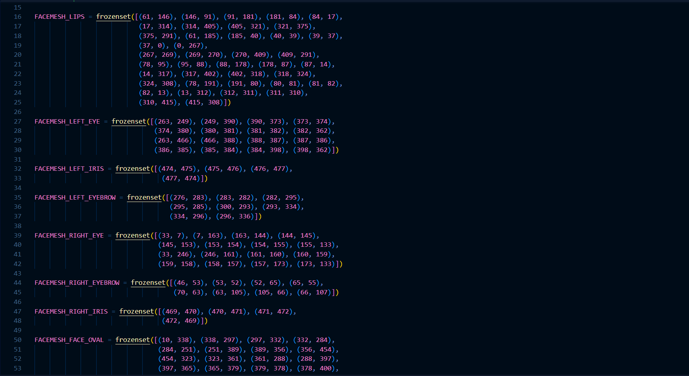

# Mediapipe Modülü Kullanılarak Oluşturulmuş Göz Bebeği Takip Sistemi

Merhaba! Bu projemde **mediapipe** modülünü kullanarak **göz bebeği konumunun x ve y koordinatlarını** pygame oyun penceresindeki uçağın koordinatları olarak güncelliyorum ve kontrolünü sağlıyorum. Dilerseniz Mediapipe modülünden biraz daha bahsedelim. Mediapipe, **Google** tarafından geliştirilen ve **görüntü işleme** uygulamaları için kullanılan bir açık kaynaklı bir çerçevedir. Görüntü ve video analizi, el hareketi tanıma, yüz algılama, vücut izleme gibi birçok görev için kullanılabilir. İşlevselliği, önceden **eğitilmiş model ve modüllerin** kullanımını içerir.
Mediapipe modülü içeriğini incelediğimiz zaman, **burun, göz bebeği ve çevresi, dudaklar, yüz çevresi gibi birçok alanın** hazır olarak eğitildiğini ve **landmark** noktalarının tespit edildiğini görebilirsiniz. Örneğini görsel olarak koyuyorum, bu anlamanıza yardımcı olacaktır.

Peki bu **landmark** olarak adlandırdığımız noktalar ne oluyor? Her insanın burun ve dudak arasındaki mesafe, gözleri arasındaki mesafe, burun delikleri arasındaki mesafe ya da dudaklarının genişliği farklıdır fakat herkeste geçerli olmak üzere sabit bir **referans aralığı** elbet ki vardır. İşte bu bahsettiğimiz **landmark noktaları da bu kısımları baz alıyor** olarak düşünebiliriz. Yüzümüzün belirli noktalarında bulunan anahtar kısımlar olarak da kodlayabiliriz. Daha iyi anlamanız için birkaç görseli sizlerle paylaşacağım.

Medipipe modülünün sadece yüz üzerine çalışmadığını ve görüntü işleme konusunda daha birçok veride faydalı işlevlere sahip olduğunu yazımızın başında bahsetmiştik. Bu alanlardan bazıları şunlardır.
- Object Detection
- Image Classification
- Image Segmentation
- Interactive Segmentation
- Hand Landmark Detection
- Face Detection
- Pose Landmark Detection
.
.
.

Liste buradaki benzer başlıklar üzerine devam etmektedir. Daha fazla detaylı bilgi sahibi olmak isterseniz **[Google Mediapipe](https://developers.google.com/mediapipe "Google Mediapipe")** sayfasını ziyaret edebilirsiniz.

